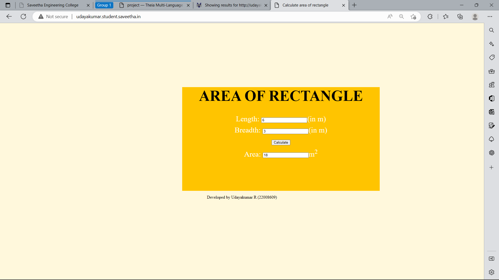

# Design a Website for Server Side Processing

# AIM:

To design a website to perform mathematical calculations in server side.

# DESIGN STEPS:

## Step 1:

Design your website for any mathematical calculation using wireframe work.

## Step 2:

Use HTML and CSS to execute the wireframe work.

## Step 3:

Use views.py to execute the coding in serverside.

## Step 4:

Mention the path of the website in urls.py.

## Step 5:

Give the urls in urls.py

## Step 6:

Publish the website in the given URL


# PROGRAM:
```html
math.html :

<!DOCTYPE html>
<html>
    <head>
        
        <Title>Calculate area of rectangle</Title>
        <meta name="viewport" content="width=device-width, initial-scale=1.0">
        <style>
        body{background-color:cornsilk;
        }
        .edge{
            width:1080px;
            margin-left:auto;
            margin-right: auto;
            padding-top: 200px;
            padding-left: 300px;
        }
        .box{
            display: block;
            border: rgb(103, 139, 61);
            width:760px;
            min-height: 400px;
            font-size: 29px;
            background-color:rgb(255, 196, 0);
            text-align:center;
            margin-left:auto;
            margin-right: auto;
        }
        .formelt{
            color:white;
            text-align: center;
            margin-top: 10px;
            margin-bottom: 10px;
        }
        .h1{
            color:black;
            text-align: center;
            font-size:small;
            padding-top: 50px;
        }

        </style>

    </head>
    <body>
        <div class="edge">
            <div class="box">
                <h1>AREA OF RECTANGLE</h1>
                <form method="POST">
                
                <div class="formelt">
                    Length: <input type="text" name="length" value="{{1}}"></input>(in m)<br/>
                </div>
                <div class="formelt">
                    Breadth: <input type="text" name="breadth" value="{{1}}"></input>(in m)<br/>
                </div>
                <div class="formelt">
                    <input type="submit" value="Calculate"></input><br/>
                </div>
                <div class="formelt">
                    Area: <input type="text" name="area" value="{{area}}"></input>m<sup>2</sup><br/>
                </div>
                </form>
            </div>

        </div>
        <p align='center'>Developed by Udayakumar R (22008609)</p>
    </body>
</html>
```
```html
views.py :

from django.shortcuts import render
def rectarea(request):
    context={}
    context['area'] = "0"
    context['l'] = "0"
    context['b'] = "0"
    if request.method == 'POST':
        print("POST method is used")
        l = request.POST.get('length','0')
        b = request.POST.get('breadth','0')
        print('request=',request)
        print('Length=',l)
        print('Breadth=',b)
        area = int(l) * int(b)
        context['area'] = area
        context['l'] = l
        context['b'] = b
        print('Area=',area)
    return render(request,'myapp/math.html',context)
```
```html
urls.py :

from django.contrib import admin
from django.urls import path
from myapp import views
urlpatterns = [
    path('admin/', admin.site.urls),
    path('areaofrectangle/',views.rectarea,name="areaofrectangle"),
    path('',views.rectarea,name="areaofrectangleroot")
]
```

# OUTPUT:

# RESULT:

The program is executed succesfully
